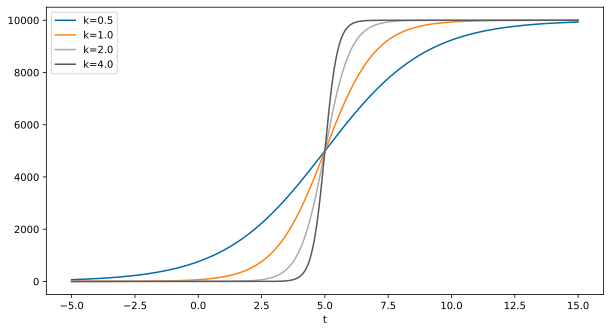
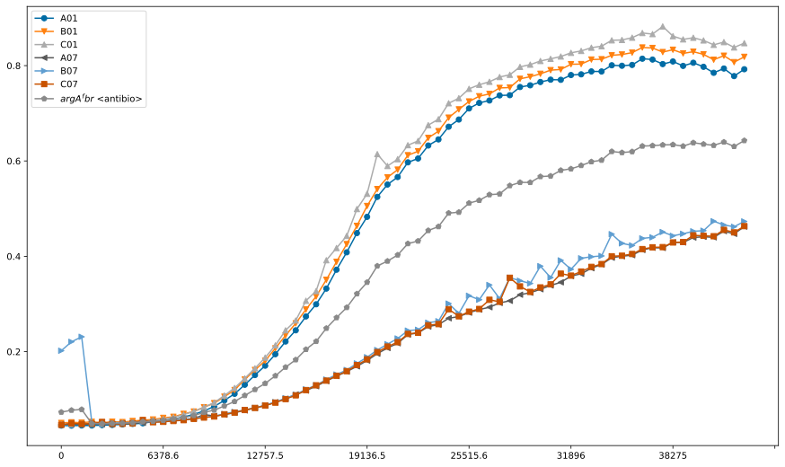
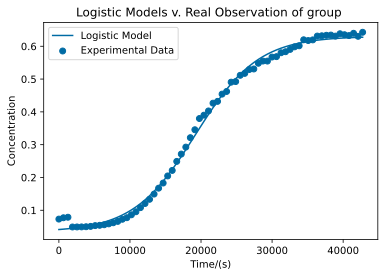
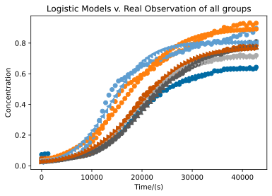
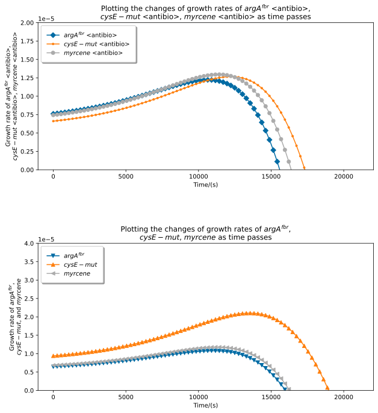
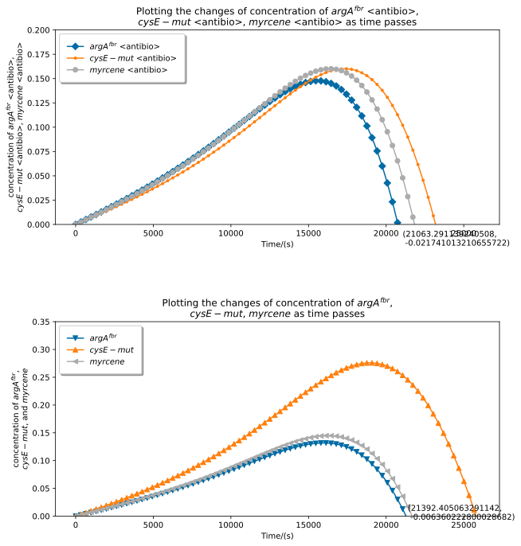

# Modeling

## Preliminaries

Based on our experimental results, we trained a logistic regression model that predicts concentration  based on time. We then use a greedy algorithm that applies scaling towards the initial population in order to maximize the minimum valid time among the three.
$$
\frac {dA} {dt} = kP(1-\frac{P}{N_m})
$$
taking the integral, we get
$$
A(t) = \frac{N_m}{1+\frac{N_m-P_0}{P_0}e^{-kt}}
$$

#### Optimization objectives

* a simple logistic model that fits into the experimental results, with parameters $k$ and $N_m$
* 


```python
# from __future__ import muli
import itertools
import numpy as np
from matplotlib import pyplot as plt
import matplotlib.patches as patches
plt.style.use("tableau-colorblind10")
import pandas as pd
from scipy import integrate

FS = (8, 4)  # figure size
```


```python
# Giving it some tries
t = np.linspace(-5, 15, 1000)

fig = plt.figure(figsize=(10, 18))

ax = fig.add_subplot(3, 1, 1)
t0, L = 5., 10000.
for k in [0.5,1.,2.,4.]:
    D = L / (1. + np.exp(-k * (t - t0)))
    _ = plt.plot(t, D, label=f'k={k}')
_ = ax.legend()
_ = ax.set_xlabel('t')

ax = fig.add_subplot(3, 1, 2)
L, k = 10000., 2
for t0 in [2,4,6,8]:
    D = L / (1. + np.exp(-k * (t - t0)))
    _ = plt.plot(t, D, label=f't0={t0}')
_ = ax.legend()
_ = ax.set_xlabel('t')

ax = fig.add_subplot(3, 1, 3)
t0, k = 5., 2
for L in range(4, 8):
    L *= 2000
    D = L / (1. + np.exp(-k * (t - t0)))
    _ = plt.plot(t, D, label=f'L={L}')
_ = ax.legend()
_ = ax.set_xlabel('t')
```


​    

​    


```python
df = pd.read_csv('experimental_results.csv')
```


```python
df
```


<div>
<style scoped>
    .dataframe tbody tr th:only-of-type {
        vertical-align: middle;
    }

    .dataframe tbody tr th {
        vertical-align: top;
    }
    
    .dataframe thead th {
        text-align: right;
    }
</style>
<table border="1" class="dataframe">
  <thead>
    <tr style="text-align: right;">
      <th></th>
      <th>Trial</th>
      <th>0</th>
      <th>637.9</th>
      <th>1275.7</th>
      <th>1913.5</th>
      <th>2551.3</th>
      <th>3189.4</th>
      <th>3827.2</th>
      <th>4465.1</th>
      <th>5102.8</th>
      <th>...</th>
      <th>36999.2</th>
      <th>37637.1</th>
      <th>38275</th>
      <th>38912.9</th>
      <th>39550.9</th>
      <th>40188.8</th>
      <th>40826.6</th>
      <th>41464.5</th>
      <th>42102.4</th>
      <th>42740.3</th>
    </tr>
  </thead>
  <tbody>
    <tr>
      <th>0</th>
      <td>A01</td>
      <td>0.0450</td>
      <td>0.0449</td>
      <td>0.0452</td>
      <td>0.0451</td>
      <td>0.0459</td>
      <td>0.0463</td>
      <td>0.0476</td>
      <td>0.0485</td>
      <td>0.0498</td>
      <td>...</td>
      <td>0.8127</td>
      <td>0.8032</td>
      <td>0.8087</td>
      <td>0.7994</td>
      <td>0.8060</td>
      <td>0.7975</td>
      <td>0.7849</td>
      <td>0.7939</td>
      <td>0.7780</td>
      <td>0.7924</td>
    </tr>
    <tr>
      <th>1</th>
      <td>A02</td>
      <td>0.0459</td>
      <td>0.0459</td>
      <td>0.0460</td>
      <td>0.0464</td>
      <td>0.0468</td>
      <td>0.0476</td>
      <td>0.0486</td>
      <td>0.0496</td>
      <td>0.0509</td>
      <td>...</td>
      <td>0.8858</td>
      <td>0.8895</td>
      <td>0.9066</td>
      <td>0.9023</td>
      <td>0.9309</td>
      <td>0.9392</td>
      <td>0.9300</td>
      <td>0.9581</td>
      <td>0.9345</td>
      <td>0.9616</td>
    </tr>
    <tr>
      <th>2</th>
      <td>A03</td>
      <td>0.0456</td>
      <td>0.0458</td>
      <td>0.0461</td>
      <td>0.0466</td>
      <td>0.0471</td>
      <td>0.0483</td>
      <td>0.0502</td>
      <td>0.0508</td>
      <td>0.0523</td>
      <td>...</td>
      <td>0.7782</td>
      <td>0.7730</td>
      <td>0.7863</td>
      <td>0.7877</td>
      <td>0.7953</td>
      <td>0.7901</td>
      <td>0.7775</td>
      <td>0.7842</td>
      <td>0.7684</td>
      <td>0.7794</td>
    </tr>
    <tr>
      <th>3</th>
      <td>A04</td>
      <td>0.0446</td>
      <td>0.0448</td>
      <td>0.0451</td>
      <td>0.0453</td>
      <td>0.0457</td>
      <td>0.0462</td>
      <td>0.0478</td>
      <td>0.0483</td>
      <td>0.0496</td>
      <td>...</td>
      <td>0.8160</td>
      <td>0.8141</td>
      <td>0.8176</td>
      <td>0.8104</td>
      <td>0.8172</td>
      <td>0.8085</td>
      <td>0.7979</td>
      <td>0.8039</td>
      <td>0.7900</td>
      <td>0.8030</td>
    </tr>
    <tr>
      <th>4</th>
      <td>A05</td>
      <td>0.0445</td>
      <td>0.0449</td>
      <td>0.0455</td>
      <td>0.0457</td>
      <td>0.0459</td>
      <td>0.0467</td>
      <td>0.0484</td>
      <td>0.0491</td>
      <td>0.0511</td>
      <td>...</td>
      <td>0.9163</td>
      <td>0.9056</td>
      <td>0.9344</td>
      <td>0.9267</td>
      <td>0.9338</td>
      <td>0.9434</td>
      <td>0.9260</td>
      <td>0.9494</td>
      <td>0.9215</td>
      <td>0.9427</td>
    </tr>
    <tr>
      <th>5</th>
      <td>A06</td>
      <td>0.0457</td>
      <td>0.0459</td>
      <td>0.0470</td>
      <td>0.0476</td>
      <td>0.0464</td>
      <td>0.0474</td>
      <td>0.0488</td>
      <td>0.0496</td>
      <td>0.0512</td>
      <td>...</td>
      <td>0.8082</td>
      <td>0.8017</td>
      <td>0.8100</td>
      <td>0.8059</td>
      <td>0.8210</td>
      <td>0.8239</td>
      <td>0.8162</td>
      <td>0.8273</td>
      <td>0.8120</td>
      <td>0.8228</td>
    </tr>
    <tr>
      <th>6</th>
      <td>A07</td>
      <td>0.0471</td>
      <td>0.0481</td>
      <td>0.0481</td>
      <td>0.0480</td>
      <td>0.0482</td>
      <td>0.0485</td>
      <td>0.0496</td>
      <td>0.0501</td>
      <td>0.0506</td>
      <td>...</td>
      <td>0.4180</td>
      <td>0.4175</td>
      <td>0.4294</td>
      <td>0.4291</td>
      <td>0.4394</td>
      <td>0.4410</td>
      <td>0.4398</td>
      <td>0.4528</td>
      <td>0.4471</td>
      <td>0.4623</td>
    </tr>
    <tr>
      <th>7</th>
      <td>A08</td>
      <td>0.0462</td>
      <td>0.0474</td>
      <td>0.0490</td>
      <td>0.0484</td>
      <td>0.0495</td>
      <td>0.0493</td>
      <td>0.0521</td>
      <td>0.0529</td>
      <td>0.0541</td>
      <td>...</td>
      <td>0.8316</td>
      <td>0.7980</td>
      <td>0.8750</td>
      <td>0.8514</td>
      <td>0.8851</td>
      <td>0.8929</td>
      <td>0.8690</td>
      <td>0.9004</td>
      <td>0.8711</td>
      <td>0.9012</td>
    </tr>
    <tr>
      <th>8</th>
      <td>A09</td>
      <td>0.0463</td>
      <td>0.0464</td>
      <td>0.0478</td>
      <td>0.0472</td>
      <td>0.0478</td>
      <td>0.0482</td>
      <td>0.0498</td>
      <td>0.0505</td>
      <td>0.0515</td>
      <td>...</td>
      <td>0.6156</td>
      <td>0.6130</td>
      <td>0.6210</td>
      <td>0.6258</td>
      <td>0.6271</td>
      <td>0.6297</td>
      <td>0.6172</td>
      <td>0.6345</td>
      <td>0.6247</td>
      <td>0.6464</td>
    </tr>
    <tr>
      <th>9</th>
      <td>A10</td>
      <td>0.0445</td>
      <td>0.0451</td>
      <td>0.0457</td>
      <td>0.0455</td>
      <td>0.0457</td>
      <td>0.0460</td>
      <td>0.0467</td>
      <td>0.0473</td>
      <td>0.0480</td>
      <td>...</td>
      <td>0.4182</td>
      <td>0.4271</td>
      <td>0.4322</td>
      <td>0.4338</td>
      <td>0.4472</td>
      <td>0.4527</td>
      <td>0.4484</td>
      <td>0.4640</td>
      <td>0.4548</td>
      <td>0.4717</td>
    </tr>
    <tr>
      <th>10</th>
      <td>A11</td>
      <td>0.0449</td>
      <td>0.0456</td>
      <td>0.0463</td>
      <td>0.0467</td>
      <td>0.0465</td>
      <td>0.0478</td>
      <td>0.0486</td>
      <td>0.0507</td>
      <td>0.0548</td>
      <td>...</td>
      <td>0.6892</td>
      <td>0.6892</td>
      <td>0.7047</td>
      <td>0.6901</td>
      <td>0.6716</td>
      <td>0.7227</td>
      <td>0.6563</td>
      <td>0.7107</td>
      <td>0.6773</td>
      <td>0.7081</td>
    </tr>
    <tr>
      <th>11</th>
      <td>A12</td>
      <td>0.0528</td>
      <td>0.0539</td>
      <td>0.0545</td>
      <td>0.0536</td>
      <td>0.0550</td>
      <td>0.0588</td>
      <td>0.0566</td>
      <td>0.0569</td>
      <td>0.0569</td>
      <td>...</td>
      <td>0.5434</td>
      <td>0.5435</td>
      <td>0.5541</td>
      <td>0.5484</td>
      <td>0.5630</td>
      <td>0.5613</td>
      <td>0.5541</td>
      <td>0.5691</td>
      <td>0.5525</td>
      <td>0.5686</td>
    </tr>
    <tr>
      <th>12</th>
      <td>B01</td>
      <td>0.0505</td>
      <td>0.0518</td>
      <td>0.0511</td>
      <td>0.0528</td>
      <td>0.0509</td>
      <td>0.0530</td>
      <td>0.0523</td>
      <td>0.0545</td>
      <td>0.0564</td>
      <td>...</td>
      <td>0.8370</td>
      <td>0.8284</td>
      <td>0.8333</td>
      <td>0.8256</td>
      <td>0.8292</td>
      <td>0.8236</td>
      <td>0.8124</td>
      <td>0.8208</td>
      <td>0.8072</td>
      <td>0.8184</td>
    </tr>
    <tr>
      <th>13</th>
      <td>B02</td>
      <td>0.0461</td>
      <td>0.0468</td>
      <td>0.0464</td>
      <td>0.0474</td>
      <td>0.0476</td>
      <td>0.0483</td>
      <td>0.0494</td>
      <td>0.0504</td>
      <td>0.0523</td>
      <td>...</td>
      <td>0.9409</td>
      <td>0.9354</td>
      <td>0.9474</td>
      <td>0.9476</td>
      <td>0.9513</td>
      <td>0.9501</td>
      <td>0.9331</td>
      <td>0.9495</td>
      <td>0.9286</td>
      <td>0.9472</td>
    </tr>
    <tr>
      <th>14</th>
      <td>B03</td>
      <td>0.0460</td>
      <td>0.0457</td>
      <td>0.0466</td>
      <td>0.0472</td>
      <td>0.0473</td>
      <td>0.0483</td>
      <td>0.0498</td>
      <td>0.0509</td>
      <td>0.0526</td>
      <td>...</td>
      <td>0.8154</td>
      <td>0.8152</td>
      <td>0.8286</td>
      <td>0.8279</td>
      <td>0.8331</td>
      <td>0.8310</td>
      <td>0.8171</td>
      <td>0.8191</td>
      <td>0.8069</td>
      <td>0.8159</td>
    </tr>
    <tr>
      <th>15</th>
      <td>B04</td>
      <td>0.0465</td>
      <td>0.0470</td>
      <td>0.0469</td>
      <td>0.0473</td>
      <td>0.0475</td>
      <td>0.0480</td>
      <td>0.0491</td>
      <td>0.0504</td>
      <td>0.0512</td>
      <td>...</td>
      <td>0.8830</td>
      <td>0.8838</td>
      <td>0.8998</td>
      <td>0.9071</td>
      <td>0.9219</td>
      <td>0.9309</td>
      <td>0.9285</td>
      <td>0.9496</td>
      <td>0.9464</td>
      <td>0.9701</td>
    </tr>
    <tr>
      <th>16</th>
      <td>B05</td>
      <td>0.0473</td>
      <td>0.0480</td>
      <td>0.0487</td>
      <td>0.0489</td>
      <td>0.0491</td>
      <td>0.0494</td>
      <td>0.0511</td>
      <td>0.0526</td>
      <td>0.0538</td>
      <td>...</td>
      <td>0.8917</td>
      <td>0.8887</td>
      <td>0.9072</td>
      <td>0.9189</td>
      <td>0.9215</td>
      <td>0.9412</td>
      <td>0.9266</td>
      <td>0.9549</td>
      <td>0.9657</td>
      <td>0.9871</td>
    </tr>
    <tr>
      <th>17</th>
      <td>B06</td>
      <td>0.0456</td>
      <td>0.0459</td>
      <td>0.0460</td>
      <td>0.0465</td>
      <td>0.0467</td>
      <td>0.0476</td>
      <td>0.0491</td>
      <td>0.0503</td>
      <td>0.0515</td>
      <td>...</td>
      <td>0.8962</td>
      <td>0.8838</td>
      <td>0.8892</td>
      <td>0.8845</td>
      <td>0.8885</td>
      <td>0.8863</td>
      <td>0.8810</td>
      <td>0.8865</td>
      <td>0.8761</td>
      <td>0.8840</td>
    </tr>
    <tr>
      <th>18</th>
      <td>B07</td>
      <td>0.2020</td>
      <td>0.2207</td>
      <td>0.2312</td>
      <td>0.0507</td>
      <td>0.0489</td>
      <td>0.0504</td>
      <td>0.0500</td>
      <td>0.0510</td>
      <td>0.0531</td>
      <td>...</td>
      <td>0.4398</td>
      <td>0.4510</td>
      <td>0.4430</td>
      <td>0.4473</td>
      <td>0.4525</td>
      <td>0.4538</td>
      <td>0.4736</td>
      <td>0.4658</td>
      <td>0.4620</td>
      <td>0.4732</td>
    </tr>
    <tr>
      <th>19</th>
      <td>B08</td>
      <td>0.0504</td>
      <td>0.0495</td>
      <td>0.0502</td>
      <td>0.0504</td>
      <td>0.0510</td>
      <td>0.0517</td>
      <td>0.0530</td>
      <td>0.0539</td>
      <td>0.0558</td>
      <td>...</td>
      <td>0.8915</td>
      <td>0.8987</td>
      <td>0.9028</td>
      <td>0.9319</td>
      <td>0.8974</td>
      <td>0.9322</td>
      <td>0.8824</td>
      <td>0.9245</td>
      <td>0.9195</td>
      <td>0.9259</td>
    </tr>
    <tr>
      <th>20</th>
      <td>B09</td>
      <td>0.0473</td>
      <td>0.0472</td>
      <td>0.0480</td>
      <td>0.0480</td>
      <td>0.0488</td>
      <td>0.0491</td>
      <td>0.0517</td>
      <td>0.0512</td>
      <td>0.0522</td>
      <td>...</td>
      <td>0.5819</td>
      <td>0.5810</td>
      <td>0.5936</td>
      <td>0.5963</td>
      <td>0.6031</td>
      <td>0.6012</td>
      <td>0.5948</td>
      <td>0.6107</td>
      <td>0.6014</td>
      <td>0.6110</td>
    </tr>
    <tr>
      <th>21</th>
      <td>B10</td>
      <td>0.0543</td>
      <td>0.0544</td>
      <td>0.0535</td>
      <td>0.0549</td>
      <td>0.0541</td>
      <td>0.0556</td>
      <td>0.0549</td>
      <td>0.0564</td>
      <td>0.0571</td>
      <td>...</td>
      <td>0.7874</td>
      <td>0.8405</td>
      <td>0.8204</td>
      <td>0.8416</td>
      <td>0.9155</td>
      <td>0.9514</td>
      <td>0.9047</td>
      <td>1.0304</td>
      <td>0.9612</td>
      <td>1.0241</td>
    </tr>
    <tr>
      <th>22</th>
      <td>B11</td>
      <td>0.0469</td>
      <td>0.0474</td>
      <td>0.0472</td>
      <td>0.0473</td>
      <td>0.0474</td>
      <td>0.0480</td>
      <td>0.0492</td>
      <td>0.0502</td>
      <td>0.0517</td>
      <td>...</td>
      <td>0.7282</td>
      <td>0.7716</td>
      <td>0.7649</td>
      <td>0.7431</td>
      <td>0.7847</td>
      <td>0.8052</td>
      <td>0.7814</td>
      <td>0.7784</td>
      <td>0.7643</td>
      <td>0.7782</td>
    </tr>
    <tr>
      <th>23</th>
      <td>B12</td>
      <td>0.0454</td>
      <td>0.0457</td>
      <td>0.0460</td>
      <td>0.0464</td>
      <td>0.0463</td>
      <td>0.0468</td>
      <td>0.0481</td>
      <td>0.0486</td>
      <td>0.0498</td>
      <td>...</td>
      <td>0.7579</td>
      <td>0.7459</td>
      <td>0.7710</td>
      <td>0.7711</td>
      <td>0.7909</td>
      <td>0.7966</td>
      <td>0.7713</td>
      <td>0.8015</td>
      <td>0.7855</td>
      <td>0.8102</td>
    </tr>
    <tr>
      <th>24</th>
      <td>C01</td>
      <td>0.0475</td>
      <td>0.0477</td>
      <td>0.0488</td>
      <td>0.0487</td>
      <td>0.0484</td>
      <td>0.0494</td>
      <td>0.0507</td>
      <td>0.0516</td>
      <td>0.0530</td>
      <td>...</td>
      <td>0.8661</td>
      <td>0.8822</td>
      <td>0.8618</td>
      <td>0.8550</td>
      <td>0.8585</td>
      <td>0.8528</td>
      <td>0.8436</td>
      <td>0.8493</td>
      <td>0.8381</td>
      <td>0.8471</td>
    </tr>
    <tr>
      <th>25</th>
      <td>C02</td>
      <td>0.0511</td>
      <td>0.0516</td>
      <td>0.0503</td>
      <td>0.0515</td>
      <td>0.0509</td>
      <td>0.0551</td>
      <td>0.0576</td>
      <td>0.0546</td>
      <td>0.0571</td>
      <td>...</td>
      <td>0.9389</td>
      <td>0.9238</td>
      <td>0.9419</td>
      <td>0.9389</td>
      <td>0.9407</td>
      <td>0.9355</td>
      <td>0.9312</td>
      <td>0.9236</td>
      <td>0.9053</td>
      <td>0.8985</td>
    </tr>
    <tr>
      <th>26</th>
      <td>C03</td>
      <td>0.0479</td>
      <td>0.0477</td>
      <td>0.0493</td>
      <td>0.0484</td>
      <td>0.0494</td>
      <td>0.0496</td>
      <td>0.0521</td>
      <td>0.0530</td>
      <td>0.0539</td>
      <td>...</td>
      <td>0.8159</td>
      <td>0.8142</td>
      <td>0.8180</td>
      <td>0.8111</td>
      <td>0.8131</td>
      <td>0.8049</td>
      <td>0.7944</td>
      <td>0.7976</td>
      <td>0.7843</td>
      <td>0.7924</td>
    </tr>
    <tr>
      <th>27</th>
      <td>C04</td>
      <td>0.0460</td>
      <td>0.0454</td>
      <td>0.0457</td>
      <td>0.0460</td>
      <td>0.0462</td>
      <td>0.0468</td>
      <td>0.0478</td>
      <td>0.0486</td>
      <td>0.0501</td>
      <td>...</td>
      <td>0.8595</td>
      <td>0.8445</td>
      <td>0.8480</td>
      <td>0.8435</td>
      <td>0.8456</td>
      <td>0.8411</td>
      <td>0.8317</td>
      <td>0.8367</td>
      <td>0.8251</td>
      <td>0.8335</td>
    </tr>
    <tr>
      <th>28</th>
      <td>C05</td>
      <td>0.0456</td>
      <td>0.0454</td>
      <td>0.0458</td>
      <td>0.0468</td>
      <td>0.0464</td>
      <td>0.0471</td>
      <td>0.0484</td>
      <td>0.0502</td>
      <td>0.0515</td>
      <td>...</td>
      <td>0.9158</td>
      <td>0.9278</td>
      <td>0.9401</td>
      <td>0.9536</td>
      <td>0.9846</td>
      <td>1.0126</td>
      <td>1.0248</td>
      <td>1.0672</td>
      <td>1.0725</td>
      <td>1.1112</td>
    </tr>
    <tr>
      <th>29</th>
      <td>C06</td>
      <td>0.0463</td>
      <td>0.0466</td>
      <td>0.0466</td>
      <td>0.0474</td>
      <td>0.0471</td>
      <td>0.0480</td>
      <td>0.0491</td>
      <td>0.0506</td>
      <td>0.0521</td>
      <td>...</td>
      <td>0.8684</td>
      <td>0.8677</td>
      <td>0.8728</td>
      <td>0.8677</td>
      <td>0.8702</td>
      <td>0.8632</td>
      <td>0.8534</td>
      <td>0.8585</td>
      <td>0.8466</td>
      <td>0.8556</td>
    </tr>
    <tr>
      <th>30</th>
      <td>C07</td>
      <td>0.0466</td>
      <td>0.0499</td>
      <td>0.0483</td>
      <td>0.0490</td>
      <td>0.0526</td>
      <td>0.0484</td>
      <td>0.0487</td>
      <td>0.0496</td>
      <td>0.0565</td>
      <td>...</td>
      <td>0.4189</td>
      <td>0.4193</td>
      <td>0.4291</td>
      <td>0.4299</td>
      <td>0.4440</td>
      <td>0.4430</td>
      <td>0.4421</td>
      <td>0.4555</td>
      <td>0.4502</td>
      <td>0.4633</td>
    </tr>
    <tr>
      <th>31</th>
      <td>C08</td>
      <td>0.0470</td>
      <td>0.0471</td>
      <td>0.0476</td>
      <td>0.0481</td>
      <td>0.0483</td>
      <td>0.0488</td>
      <td>0.0503</td>
      <td>0.0512</td>
      <td>0.0535</td>
      <td>...</td>
      <td>0.8910</td>
      <td>0.9199</td>
      <td>0.9165</td>
      <td>0.9207</td>
      <td>0.9447</td>
      <td>0.9188</td>
      <td>0.9286</td>
      <td>0.9362</td>
      <td>0.9502</td>
      <td>0.9435</td>
    </tr>
    <tr>
      <th>32</th>
      <td>C09</td>
      <td>0.0515</td>
      <td>0.0517</td>
      <td>0.0503</td>
      <td>0.0539</td>
      <td>0.0522</td>
      <td>0.0563</td>
      <td>0.0537</td>
      <td>0.0567</td>
      <td>0.0576</td>
      <td>...</td>
      <td>0.6343</td>
      <td>0.6424</td>
      <td>0.6439</td>
      <td>0.6449</td>
      <td>0.6652</td>
      <td>0.6560</td>
      <td>0.6598</td>
      <td>0.6582</td>
      <td>0.6595</td>
      <td>0.6723</td>
    </tr>
    <tr>
      <th>33</th>
      <td>C10</td>
      <td>0.0468</td>
      <td>0.0472</td>
      <td>0.0473</td>
      <td>0.0480</td>
      <td>0.0474</td>
      <td>0.0482</td>
      <td>0.0489</td>
      <td>0.0493</td>
      <td>0.0497</td>
      <td>...</td>
      <td>0.7022</td>
      <td>0.7031</td>
      <td>0.7131</td>
      <td>0.7146</td>
      <td>0.7292</td>
      <td>0.7294</td>
      <td>0.7273</td>
      <td>0.7427</td>
      <td>0.7418</td>
      <td>0.7595</td>
    </tr>
    <tr>
      <th>34</th>
      <td>C11</td>
      <td>0.0470</td>
      <td>0.0473</td>
      <td>0.0466</td>
      <td>0.0476</td>
      <td>0.0470</td>
      <td>0.0488</td>
      <td>0.0489</td>
      <td>0.0506</td>
      <td>0.0537</td>
      <td>...</td>
      <td>0.8090</td>
      <td>0.7906</td>
      <td>0.8176</td>
      <td>0.8181</td>
      <td>0.8283</td>
      <td>0.8325</td>
      <td>0.8038</td>
      <td>0.8421</td>
      <td>0.8173</td>
      <td>0.8465</td>
    </tr>
    <tr>
      <th>35</th>
      <td>C12</td>
      <td>0.0460</td>
      <td>0.0463</td>
      <td>0.0461</td>
      <td>0.0467</td>
      <td>0.0464</td>
      <td>0.0472</td>
      <td>0.0482</td>
      <td>0.0481</td>
      <td>0.0492</td>
      <td>...</td>
      <td>0.6923</td>
      <td>0.6816</td>
      <td>0.7194</td>
      <td>0.7252</td>
      <td>0.7478</td>
      <td>0.7448</td>
      <td>0.7334</td>
      <td>0.7608</td>
      <td>0.7418</td>
      <td>0.7736</td>
    </tr>
  </tbody>
</table>
<p>36 rows × 69 columns</p>
</div>


```python
total = df.groupby('Trial').sum().max(axis=1)
```


```python
all_sets = total.index.to_list()
```


```python
all_sets
```


    ['A01',
     'A02',
     'A03',
     'A04',
     'A05',
     'A06',
     'A07',
     'A08',
     'A09',
     'A10',
     'A11',
     'A12',
     'B01',
     'B02',
     'B03',
     'B04',
     'B05',
     'B06',
     'B07',
     'B08',
     'B09',
     'B10',
     'B11',
     'B12',
     'C01',
     'C02',
     'C03',
     'C04',
     'C05',
     'C06',
     'C07',
     'C08',
     'C09',
     'C10',
     'C11',
     'C12']


```python
all_data =  pd.DataFrame()
for set in all_sets:
    temp = df[df['Trial'] == set][df.columns[1:]].T.sum(axis=1)
#     temp.index = pd.to_datetime(temp.index)
    temp = temp.to_frame(set)
    all_data = pd.concat([all_data, temp], axis=1)
all_data['$argA^fbr$ <antibio>'] = all_data[['A01', 'B01','C01','A07', 'B07','C07']].mean(axis=1)
all_data['$cysE-mut$ <antibio>'] = all_data[['A02', 'B02','C02','A08', 'B08','C08']].mean(axis=1)
all_data['$myrcene$ <antibio>'] = all_data[['A03', 'B03','C03','A09', 'B09','C09']].mean(axis=1)
all_data['$argA^fbr$'] = all_data[['A04', 'B04','C04','A10', 'B10','C10']].mean(axis=1)
all_data['$cysE-mut$'] = all_data[['A05', 'B05','C05','A11', 'B11','C11']].mean(axis=1)
all_data['$myrcene$'] = all_data[['A06', 'B06','C06','A12', 'B12','C12']].mean(axis=1)
# all_data['avg11_antibio'] = all_data[['A07', 'B07','C07']].mean(axis=1)
# all_data['avg22_antibio'] = all_data[['A08', 'B08','C08']].mean(axis=1)
# all_data['avg33_antibio'] = all_data[[].mean(axis=1)
# all_data['avg44_antibio'] = all_data[[].mean(axis=1)
# all_data['avg55_antibio'] = all_data[[].mean(axis=1)
# all_data['avg66_antibio'] = all_data[[]].mean(axis=1)
```


```python
all_data
```


<div>
<style scoped>
    .dataframe tbody tr th:only-of-type {
        vertical-align: middle;
    }

    .dataframe tbody tr th {
        vertical-align: top;
    }
    
    .dataframe thead th {
        text-align: right;
    }
</style>
<table border="1" class="dataframe">
  <thead>
    <tr style="text-align: right;">
      <th></th>
      <th>A01</th>
      <th>A02</th>
      <th>A03</th>
      <th>A04</th>
      <th>A05</th>
      <th>A06</th>
      <th>A07</th>
      <th>A08</th>
      <th>A09</th>
      <th>A10</th>
      <th>...</th>
      <th>C09</th>
      <th>C10</th>
      <th>C11</th>
      <th>C12</th>
      <th>$argA^fbr$ &lt;antibio&gt;</th>
      <th>$cysE-mut$ &lt;antibio&gt;</th>
      <th>$myrcene$ &lt;antibio&gt;</th>
      <th>$argA^fbr$</th>
      <th>$cysE-mut$</th>
      <th>$myrcene$</th>
    </tr>
  </thead>
  <tbody>
    <tr>
      <th>0</th>
      <td>0.0450</td>
      <td>0.0459</td>
      <td>0.0456</td>
      <td>0.0446</td>
      <td>0.0445</td>
      <td>0.0457</td>
      <td>0.0471</td>
      <td>0.0462</td>
      <td>0.0463</td>
      <td>0.0445</td>
      <td>...</td>
      <td>0.0515</td>
      <td>0.0468</td>
      <td>0.0470</td>
      <td>0.0460</td>
      <td>0.073117</td>
      <td>0.047783</td>
      <td>0.047433</td>
      <td>0.047117</td>
      <td>0.046033</td>
      <td>0.046967</td>
    </tr>
    <tr>
      <th>637.9</th>
      <td>0.0449</td>
      <td>0.0459</td>
      <td>0.0458</td>
      <td>0.0448</td>
      <td>0.0449</td>
      <td>0.0459</td>
      <td>0.0481</td>
      <td>0.0474</td>
      <td>0.0464</td>
      <td>0.0451</td>
      <td>...</td>
      <td>0.0517</td>
      <td>0.0472</td>
      <td>0.0473</td>
      <td>0.0463</td>
      <td>0.077183</td>
      <td>0.048050</td>
      <td>0.047417</td>
      <td>0.047317</td>
      <td>0.046433</td>
      <td>0.047383</td>
    </tr>
    <tr>
      <th>1275.7</th>
      <td>0.0452</td>
      <td>0.0460</td>
      <td>0.0461</td>
      <td>0.0451</td>
      <td>0.0455</td>
      <td>0.0470</td>
      <td>0.0481</td>
      <td>0.0490</td>
      <td>0.0478</td>
      <td>0.0457</td>
      <td>...</td>
      <td>0.0503</td>
      <td>0.0473</td>
      <td>0.0466</td>
      <td>0.0461</td>
      <td>0.078783</td>
      <td>0.048250</td>
      <td>0.048017</td>
      <td>0.047367</td>
      <td>0.046683</td>
      <td>0.047700</td>
    </tr>
    <tr>
      <th>1913.5</th>
      <td>0.0451</td>
      <td>0.0464</td>
      <td>0.0466</td>
      <td>0.0453</td>
      <td>0.0457</td>
      <td>0.0476</td>
      <td>0.0480</td>
      <td>0.0484</td>
      <td>0.0472</td>
      <td>0.0455</td>
      <td>...</td>
      <td>0.0539</td>
      <td>0.0480</td>
      <td>0.0476</td>
      <td>0.0467</td>
      <td>0.049050</td>
      <td>0.048700</td>
      <td>0.048550</td>
      <td>0.047833</td>
      <td>0.047167</td>
      <td>0.048033</td>
    </tr>
    <tr>
      <th>2551.3</th>
      <td>0.0459</td>
      <td>0.0468</td>
      <td>0.0471</td>
      <td>0.0457</td>
      <td>0.0459</td>
      <td>0.0464</td>
      <td>0.0482</td>
      <td>0.0495</td>
      <td>0.0478</td>
      <td>0.0457</td>
      <td>...</td>
      <td>0.0522</td>
      <td>0.0474</td>
      <td>0.0470</td>
      <td>0.0464</td>
      <td>0.049150</td>
      <td>0.049017</td>
      <td>0.048767</td>
      <td>0.047767</td>
      <td>0.047050</td>
      <td>0.047983</td>
    </tr>
    <tr>
      <th>...</th>
      <td>...</td>
      <td>...</td>
      <td>...</td>
      <td>...</td>
      <td>...</td>
      <td>...</td>
      <td>...</td>
      <td>...</td>
      <td>...</td>
      <td>...</td>
      <td>...</td>
      <td>...</td>
      <td>...</td>
      <td>...</td>
      <td>...</td>
      <td>...</td>
      <td>...</td>
      <td>...</td>
      <td>...</td>
      <td>...</td>
      <td>...</td>
    </tr>
    <tr>
      <th>40188.8</th>
      <td>0.7975</td>
      <td>0.9392</td>
      <td>0.7901</td>
      <td>0.8085</td>
      <td>0.9434</td>
      <td>0.8239</td>
      <td>0.4410</td>
      <td>0.8929</td>
      <td>0.6297</td>
      <td>0.4527</td>
      <td>...</td>
      <td>0.6560</td>
      <td>0.7294</td>
      <td>0.8325</td>
      <td>0.7448</td>
      <td>0.635283</td>
      <td>0.928117</td>
      <td>0.718817</td>
      <td>0.785667</td>
      <td>0.876267</td>
      <td>0.779350</td>
    </tr>
    <tr>
      <th>40826.6</th>
      <td>0.7849</td>
      <td>0.9300</td>
      <td>0.7775</td>
      <td>0.7979</td>
      <td>0.9260</td>
      <td>0.8162</td>
      <td>0.4398</td>
      <td>0.8690</td>
      <td>0.6172</td>
      <td>0.4484</td>
      <td>...</td>
      <td>0.6598</td>
      <td>0.7273</td>
      <td>0.8038</td>
      <td>0.7334</td>
      <td>0.632733</td>
      <td>0.912383</td>
      <td>0.710133</td>
      <td>0.773083</td>
      <td>0.853150</td>
      <td>0.768233</td>
    </tr>
    <tr>
      <th>41464.5</th>
      <td>0.7939</td>
      <td>0.9581</td>
      <td>0.7842</td>
      <td>0.8039</td>
      <td>0.9494</td>
      <td>0.8273</td>
      <td>0.4528</td>
      <td>0.9004</td>
      <td>0.6345</td>
      <td>0.4640</td>
      <td>...</td>
      <td>0.6582</td>
      <td>0.7427</td>
      <td>0.8421</td>
      <td>0.7608</td>
      <td>0.639683</td>
      <td>0.932050</td>
      <td>0.717383</td>
      <td>0.804550</td>
      <td>0.883783</td>
      <td>0.783950</td>
    </tr>
    <tr>
      <th>42102.4</th>
      <td>0.7780</td>
      <td>0.9345</td>
      <td>0.7684</td>
      <td>0.7900</td>
      <td>0.9215</td>
      <td>0.8120</td>
      <td>0.4471</td>
      <td>0.8711</td>
      <td>0.6247</td>
      <td>0.4548</td>
      <td>...</td>
      <td>0.6595</td>
      <td>0.7418</td>
      <td>0.8173</td>
      <td>0.7418</td>
      <td>0.630433</td>
      <td>0.918200</td>
      <td>0.707533</td>
      <td>0.786550</td>
      <td>0.869767</td>
      <td>0.769083</td>
    </tr>
    <tr>
      <th>42740.3</th>
      <td>0.7924</td>
      <td>0.9616</td>
      <td>0.7794</td>
      <td>0.8030</td>
      <td>0.9427</td>
      <td>0.8228</td>
      <td>0.4623</td>
      <td>0.9012</td>
      <td>0.6464</td>
      <td>0.4717</td>
      <td>...</td>
      <td>0.6723</td>
      <td>0.7595</td>
      <td>0.8465</td>
      <td>0.7736</td>
      <td>0.642783</td>
      <td>0.929650</td>
      <td>0.719567</td>
      <td>0.810317</td>
      <td>0.895633</td>
      <td>0.785800</td>
    </tr>
  </tbody>
</table>
<p>68 rows × 42 columns</p>
</div>


```python
start = 0
ax = all_data[['A01', 'B01','C01','A07','B07','C07','$argA^fbr$ <antibio>']][start:].plot(style='-', figsize=(15,9))
markers = itertools.cycle(("o", "v", "^", "<", ">", "s", "p", "P", "*", "h", "X", "D", '.'))
for i, line in enumerate(ax.get_lines()):
    marker = next(markers)
    line.set_marker(marker)
_ = ax.legend()
```


​    

​    


```python
# Define funcion with the coefficients to estimate
def logistic(t, a, k, N_m, offset):
    return N_m / (1 + a * np.exp(-k*t)) + offset
```


```python
# Randomly initialize the coefficients
p0 = np.random.random(size=4)
p0
```


    array([0.37414072, 0.12469029, 0.22144125, 0.32700245])


```python
bounds = (0., [10017.,3.,10019834.,10000.])
```


```python
import scipy.optimize as optim
x = np.array([float(x) for x in all_data.index])
y = np.array([float(x) for x in all_data['$argA^fbr$ <antibio>']])
```


```python
(a,k,N_m,offset),cov = optim.curve_fit(logistic, x, y, bounds=bounds, p0=p0)
```


```python
a,k,N_m,offset
```


    (81.2677348627617,
     0.00022831179706840973,
     0.5963896624595766,
     0.03403315911985916)


```python
def test_logistic(t):
    return N_m / (1 + a * np.exp(-k*t)) + offset
```


```python
plt.scatter(x, y)
plt.plot(x, test_logistic(x))
plt.title('Logistic Models v. Real Observation of group $argA^fbr$ <antibio>')
plt.title('Logistic Models v. Real Observation of group ')
plt.legend(['Logistic Model','Experimental Data'])
plt.xlabel('Time/(s)')
plt.ylabel('Concentration')
```


    Text(0, 0.5, 'Concentration')


​    

​    


```python
ret_data = {
    'group_name':[],
    'a':[],
    'k':[],
    'N_m':[],
    'offset':[],
    }
```


```python
for group in all_data.columns[all_data.columns.get_loc('$argA^fbr$ <antibio>'):]:
    # cnt += 1
    p0 = np.random.random(size=4)
    y = np.array([float(x) for x in all_data[group]])
    (a,k,N_m,offset),cov = optim.curve_fit(logistic, x, y, bounds=bounds, p0=p0)
    test_logistic = lambda t : N_m / (1 + a * np.exp(-k*t)) + offset
    plt.scatter(x, y)
    ret_data['group_name'].append(group)
    ret_data['a'].append(a)
    ret_data['k'].append(k)
    ret_data['N_m'].append(N_m)
    ret_data['offset'].append(offset)
    plt.plot(x, test_logistic(x),marker = next(markers))
    plt.title(f'Logistic Models v. Real Observation of all groups')
    plt.legend(['Logistic Model','Experimental Data'])
    plt.xlabel('Time/(s)')
    plt.ylabel('Concentration')
```


​    

​    


```python
output_df = pd.DataFrame(ret_data)
output_df
```


<div>
<style scoped>
    .dataframe tbody tr th:only-of-type {
        vertical-align: middle;
    }

    .dataframe tbody tr th {
        vertical-align: top;
    }
    
    .dataframe thead th {
        text-align: right;
    }
</style>
<table border="1" class="dataframe">
  <thead>
    <tr style="text-align: right;">
      <th></th>
      <th>group_name</th>
      <th>a</th>
      <th>k</th>
      <th>N_m</th>
      <th>offset</th>
    </tr>
  </thead>
  <tbody>
    <tr>
      <th>0</th>
      <td>$argA^fbr$ &lt;antibio&gt;</td>
      <td>81.267706</td>
      <td>0.000228</td>
      <td>0.596390</td>
      <td>3.403318e-02</td>
    </tr>
    <tr>
      <th>1</th>
      <td>$cysE-mut$ &lt;antibio&gt;</td>
      <td>24.231421</td>
      <td>0.000189</td>
      <td>0.897522</td>
      <td>1.752337e-28</td>
    </tr>
    <tr>
      <th>2</th>
      <td>$myrcene$ &lt;antibio&gt;</td>
      <td>60.918954</td>
      <td>0.000218</td>
      <td>0.693091</td>
      <td>2.001469e-02</td>
    </tr>
    <tr>
      <th>3</th>
      <td>$argA^fbr$</td>
      <td>56.760507</td>
      <td>0.000191</td>
      <td>0.771270</td>
      <td>1.323640e-02</td>
    </tr>
    <tr>
      <th>4</th>
      <td>$cysE-mut$</td>
      <td>35.514929</td>
      <td>0.000261</td>
      <td>0.805412</td>
      <td>4.491076e-29</td>
    </tr>
    <tr>
      <th>5</th>
      <td>$myrcene$</td>
      <td>48.169659</td>
      <td>0.000201</td>
      <td>0.761660</td>
      <td>9.799055e-03</td>
    </tr>
  </tbody>
</table>
</div>


```python
output_df.to_csv('./outputs/out.csv')
```


```python
k1, k2, k3,k4, k5, k6 = ret_data['k']
```


```python
t = np.linspace(0,21000,80)
zero = np.linspace(0,0,1000)
quick_logistic = lambda t,i,scale=1:scale*logistic(t, ret_data['a'][i],ret_data['k'][i], ret_data['N_m'][i], ret_data['offset'][i])

derivative = lambda t,i,ii,iii,k1,k2,k3: k1 * quick_logistic(t,i) * (1- quick_logistic(t,i)/ret_data['N_m'][i]-(k2/k1)*(quick_logistic(t,ii)/ret_data['N_m'][i])-(k3/k1)*(quick_logistic(t,iii)/ret_data['N_m'][i]))

# dA_test = 
fig = plt.figure(figsize=(10, 18))
plt.subplots_adjust(hspace=0.5)

ax1 = fig.add_subplot(3,1,1)
# ax.set_ylim(bottom=0.4, top=19)
ax1.set_ylim(0,0.00002)
# for i in t[1:]:
#     val = derivative(i,0,1,2,k1,k2,k3)
#     if derivative(0,0,1,2,k1,k2,k3) >= val:
#         rect = patches.Rectangle((0,0),i,val,linewidth=1,edgecolor='r',facecolor='none')
#         ax1.text(i, val, '({},\n {})'.format(i, val))
#         break
ax1.plot(t, derivative(t,0,1,2,k1,k2,k3),marker = next(markers),label='$argA^{fbr}$ <antibio>')
ax1.plot(t, derivative(t,1,0,2,k2,k1,k3),marker = next(markers),label='$cysE-mut$ <antibio>')
ax1.plot(t, derivative(t,2,0,1,k3,k1,k2),marker = next(markers),label='$myrcene$ <antibio>')
# bound = min(derivative(0,0,1,2,k1,k2,k3),derivative(0,1,0,2,k2,k1,k3),derivative(0,2,0,1,k3,k1,k2))
leg = ax1.legend(loc='upper left',fancybox=True, framealpha=1, shadow=True, borderpad=1);
# ax1.add_patch(rect)
ax1.set_xlabel('Time/(s)')
ax1.set_ylabel("Growth rate of $argA^{fbr}$ <antibio>,\n$cysE-mut$ <antibio>, $myrcene$ <antibio>")
ax1.set_title("Plotting the changes of growth rates of $argA^{fbr}$ <antibio>,\n$cysE-mut$ <antibio>, $myrcene$ <antibio> as time passes")

ax2 = fig.add_subplot(3,1,2)
# ax.set_ylim(bottom=0.4, top=19)
ax2.set_ylim(0,0.00004)
# for i in t[1:]:
#     val = derivative(i,3,4,5,k4,k5,k6)
#     if derivative(0,3,4,5,k4,k5,k6) >= val:
#         rect = patches.Rectangle((0,0),i,val,linewidth=1,edgecolor='r',facecolor='none')
#         ax2.text(i, val, '({},\n {})'.format(i, val))
#         break
ax2.plot(t, derivative(t,3,4,5,k4,k5,k6),marker = next(markers),label='$argA^{fbr}$')
ax2.plot(t, derivative(t,4,3,5,k5,k4,k6),marker = next(markers),label='$cysE-mut$')
ax2.plot(t, derivative(t,5,3,4,k6,k4,k5),marker = next(markers),label='$myrcene$')
leg = ax2.legend(loc='upper left',fancybox=True, framealpha=1, shadow=True, borderpad=1);
# ax2.add_patch(rect)
ax2.set_xlabel('Time/(s)')
ax2.set_ylabel("Growth rate of $argA^{fbr}$,\n$cysE-mut$, and $myrcene$")
ax2.set_title("Plotting the changes of growth rates of $argA^{fbr}$,\n$cysE-mut$, $myrcene$ as time passes")
```


    Text(0.5, 1.0, 'Plotting the changes of growth rates of $argA^{fbr}$,\n$cysE-mut$, $myrcene$ as time passes')


​    

​    


```python
tt = np.linspace(0,21000,80)

quick_logistic = lambda t,i,scale=1: scale * logistic(t, ret_data['a'][i],ret_data['k'][i], ret_data['N_m'][i], ret_data['offset'][i])

derivative = lambda t,i,ii,iii,k1,k2,k3: k1 * quick_logistic(t,i) * (1- quick_logistic(t,i)/ret_data['N_m'][i]-(k2/k1)*(quick_logistic(t,ii)/ret_data['N_m'][i])-(k3/k1)*(quick_logistic(t,iii)/ret_data['N_m'][i]))

def Integral(x,i,ii,iii,k1,k2,k3):
    f = lambda x: derivative(x,i,ii,iii,k1,k2,k3)
    res = np.zeros_like(x)
    for j,val in enumerate(x):
        y,err = integrate.quad(f,0,val)
        res[j] = y
    return res
# dA_test = 
fig = plt.figure(figsize=(10, 18))
plt.subplots_adjust(hspace=0.5)

ax1 = fig.add_subplot(3,1,1)
# ax.set_ylim(bottom=0.4, top=19)
ax1.set_ylim(0,0.2)
# for i in t[1:]:
#     val = derivative(i,0,1,2,k1,k2,k3)
#     if derivative(0,0,1,2,k1,k2,k3) >= val:
#         rect = patches.Rectangle((0,0),i,val,linewidth=1,edgecolor='r',facecolor='none')
#         ax1.text(i, val, '({},\n {})'.format(i, val))
#         break
ax1.plot(tt, Integral(tt,0,1,2,k1,k2,k3),marker = next(markers),label='$argA^{fbr}$ <antibio>')
ax1.plot(tt, Integral(tt,1,0,2,k2,k1,k3),marker = next(markers),label='$cysE-mut$ <antibio>')
ax1.plot(tt, Integral(tt,2,0,1,k3,k1,k2),marker = next(markers),label='$myrcene$ <antibio>')
# bound = min(derivative(0,0,1,2,k1,k2,k3),derivative(0,1,0,2,k2,k1,k3),derivative(0,2,0,1,k3,k1,k2))
leg = ax1.legend(loc='upper left',fancybox=True, framealpha=1, shadow=True, borderpad=1);
# ax1.add_patch(rect)
ax1.set_xlabel('Time/(s)')
ax1.set_ylabel("concentration of $argA^{fbr}$ <antibio>,\n$cysE-mut$ <antibio>, $myrcene$ <antibio>")
ax1.set_title("Plotting the changes of concentration of $argA^{fbr}$ <antibio>,\n$cysE-mut$ <antibio>, $myrcene$ <antibio> as time passes")

ax2 = fig.add_subplot(3,1,2)
# ax.set_ylim(bottom=0.4, top=19)
ax2.set_ylim(0,0.4)
# for i in t[1:]:
#     val = derivative(i,3,4,5,k4,k5,k6)
#     if derivative(0,3,4,5,k4,k5,k6) >= val:
#         rect = patches.Rectangle((0,0),i,val,linewidth=1,edgecolor='r',facecolor='none')
#         ax2.text(i, val, '({},\n {})'.format(i, val))
#         break
ax2.plot(tt, Integral(tt,3,4,5,k4,k5,k6),marker = next(markers),label='$argA^{fbr}$')
ax2.plot(tt, Integral(tt,4,3,5,k5,k4,k6),marker = next(markers),label='$cysE-mut$')
ax2.plot(tt, Integral(tt,5,3,4,k6,k4,k5),marker = next(markers),label='$myrcene$')
leg = ax2.legend(loc='upper left',fancybox=True, framealpha=1, shadow=True, borderpad=1);
# ax2.add_patch(rect)
ax2.set_xlabel('Time/(s)')
ax2.set_ylabel("concentration of $argA^{fbr}$,\n$cysE-mut$, and $myrcene$")
ax2.set_title("Plotting the changes of concentration of $argA^{fbr}$,\n$cysE-mut$, $myrcene$ as time passes")
```


    Text(0.5, 1.0, 'Plotting the changes of concentration of $argA^{fbr}$,\n$cysE-mut$, $myrcene$ as time passes')



    


```python
all_val = list(zip(Integral(tt,0,1,2,k1,k2,k3),Integral(tt,1,0,2,k2,k1,k3),Integral(tt,2,0,1,k3,k1,k2)))
for i in range(1,len(all_val)):
    if min(all_val[i]) <= 0:
        print(tt[i])
        break
```

    18607.594936708858


```python
all_val = list(zip(Integral(tt,3,4,5,k4,k5,k6),Integral(tt,4,3,5,k5,k4,k6),Integral(tt,5,3,4,k6,k4,k5)))
for i in range(1,len(all_val)):
    if min(all_val[i]) <= 0:
        print(tt[i])
        break
```

    17278.481012658227


---
# BELOW ARE DRAFTS


```python
from scipy.optimize import minimize
```


```python
scaled_derivative = lambda t,i,ii,iii,k1,k2,k3,x,y,z: k1 * quick_logistic(t,i,x) * (1- quick_logistic(t,i,x)/ret_data['N_m'][i]-(k2/k1)*(quick_logistic(t,ii,y)/ret_data['N_m'][i])-(k3/k1)*(quick_logistic(t,iii,z)/ret_data['N_m'][i]))

def Integral_with_scaling(xx,i,ii,iii,k1,k2,k3,x,y,z):
    f = lambda xx: scaled_derivative(xx,i,ii,iii,k1,k2,k3,x,y,z)
    res = np.zeros_like(xx)
    for j,val in enumerate(xx):
        y,err = integrate.quad(f,0,val)
        res[j] = y
    return res

def objective(params):
    x,y = params
    all_val = list(zip(Integral_with_scaling(tt,3,4,5,k4,k5,k6,1,x,y),Integral_with_scaling(tt,4,3,5,k5,k4,k6,x,1,y),Integral_with_scaling(tt,5,3,4,k6,k4,k5,y,1,x)))
    for i in range(1,len(all_val)):
        if min(all_val[i]) <= 0:
            return tt[i]
            break
```


```python
k = objective([1.,1])
k
```


    19670.886075949365


```python
p0 = np.random.random(size=2)
p0
```


    array([0.36257077, 0.45763558])


```python
minimize(lambda arr: -objective(arr),p0)
```


    ---------------------------------------------------------------------------
    
    TypeError                                 Traceback (most recent call last)
    
    <ipython-input-52-8c610db0acfa> in <module>
    ----> 1 minimize(lambda arr: -objective(arr),p0)


    ~/miniconda3/envs/igem/lib/python3.8/site-packages/scipy/optimize/_minimize.py in minimize(fun, x0, args, method, jac, hess, hessp, bounds, constraints, tol, callback, options)
        610         return _minimize_cg(fun, x0, args, jac, callback, **options)
        611     elif meth == 'bfgs':
    --> 612         return _minimize_bfgs(fun, x0, args, jac, callback, **options)
        613     elif meth == 'newton-cg':
        614         return _minimize_newtoncg(fun, x0, args, jac, hess, hessp, callback,


    ~/miniconda3/envs/igem/lib/python3.8/site-packages/scipy/optimize/optimize.py in _minimize_bfgs(fun, x0, args, jac, callback, gtol, norm, eps, maxiter, disp, return_all, finite_diff_rel_step, **unknown_options)
       1099         maxiter = len(x0) * 200
       1100 
    -> 1101     sf = _prepare_scalar_function(fun, x0, jac, args=args, epsilon=eps,
       1102                                   finite_diff_rel_step=finite_diff_rel_step)
       1103 


    ~/miniconda3/envs/igem/lib/python3.8/site-packages/scipy/optimize/optimize.py in _prepare_scalar_function(fun, x0, jac, args, bounds, epsilon, finite_diff_rel_step, hess)
        259     # ScalarFunction caches. Reuse of fun(x) during grad
        260     # calculation reduces overall function evaluations.
    --> 261     sf = ScalarFunction(fun, x0, args, grad, hess,
        262                         finite_diff_rel_step, bounds, epsilon=epsilon)
        263 


    ~/miniconda3/envs/igem/lib/python3.8/site-packages/scipy/optimize/_differentiable_functions.py in __init__(self, fun, x0, args, grad, hess, finite_diff_rel_step, finite_diff_bounds, epsilon)
         74 
         75         self._update_fun_impl = update_fun
    ---> 76         self._update_fun()
         77 
         78         # Gradient evaluation


    ~/miniconda3/envs/igem/lib/python3.8/site-packages/scipy/optimize/_differentiable_functions.py in _update_fun(self)
        164     def _update_fun(self):
        165         if not self.f_updated:
    --> 166             self._update_fun_impl()
        167             self.f_updated = True
        168 


    ~/miniconda3/envs/igem/lib/python3.8/site-packages/scipy/optimize/_differentiable_functions.py in update_fun()
         71 
         72         def update_fun():
    ---> 73             self.f = fun_wrapped(self.x)
         74 
         75         self._update_fun_impl = update_fun


    ~/miniconda3/envs/igem/lib/python3.8/site-packages/scipy/optimize/_differentiable_functions.py in fun_wrapped(x)
         68         def fun_wrapped(x):
         69             self.nfev += 1
    ---> 70             return fun(x, *args)
         71 
         72         def update_fun():


    <ipython-input-52-8c610db0acfa> in <lambda>(arr)
    ----> 1 minimize(lambda arr: -objective(arr),p0)


    TypeError: bad operand type for unary -: 'NoneType'


```python
objective(p0)
```


```python
params = [1,1]
updated_time = 0
temp_func = lambda x,y,updated_time: min(derivative_with_scaling_1(updated_time,x,y),derivative_with_scaling_2(updated_time,x,y),derivative_with_scaling_3(updated_time,x,y))
for i in range(10):
    for j in t[1:]:
        x,y = params
        val = min(derivative_with_scaling_1(i,x,y),derivative_with_scaling_2(i,x,y),derivative_with_scaling_3(i,x,y))
        if val<=0:
            updated_time = j
            break
    # assert False
    # assert False
    # assert False 
    # assert False
    params = minimize(lambda arr,updated_time:-temp_func(updated_time,arr[0],arr[1]),x0=params,args=updated_time).x
    x,y = params
    print(f"iter {i}, {objective(params)},value {temp_func(updated_time,x,y)}")
    # assert False
```

    iter 0, 13569.620253164558,value 0.0
    iter 1, 13569.620253164558,value 0.0
    iter 2, 13569.620253164558,value 0.0
    iter 3, 13569.620253164558,value 0.0
    iter 4, 13569.620253164558,value 0.0
    iter 5, 13569.620253164558,value 0.0
    iter 6, 13569.620253164558,value 0.0
    iter 7, 13569.620253164558,value 0.0
    iter 8, 13569.620253164558,value 0.0
    iter 9, 13569.620253164558,value 0.0


```python
params
```


    array([1., 1.])


```python
i = objective(res.x)
```


```python
i = 13569.620253164558
```


```python
def fnc(params):
    x,y = params
    return min(derivative_with_scaling_1(i,x,y),derivative_with_scaling_2(i,x,y),derivative_with_scaling_3(i,x,y))
```


```python
p0 = np.random.random(size=2)
p0
```


    array([0.26309931, 0.04349631])


```python
fnc(p0)
```


    6.770824185470468e-07


```python
ret = minimize(lambda x:-fnc(x),p0)
```


```python
ret.x
```


    array([0.2501313 , 0.33309734])


```python
fnc(ret.x)
```


    5.254417101674001e-06


```python
minimize(lambda :, -1)
```


          fun: 1.0000000000000035e-08
     hess_inv: array([[1]])
          jac: array([4.00000894e-06])
      message: 'Optimization terminated successfully.'
         nfev: 4
          nit: 1
         njev: 2
       status: 0
      success: True
            x: array([0.01])


```python

```
